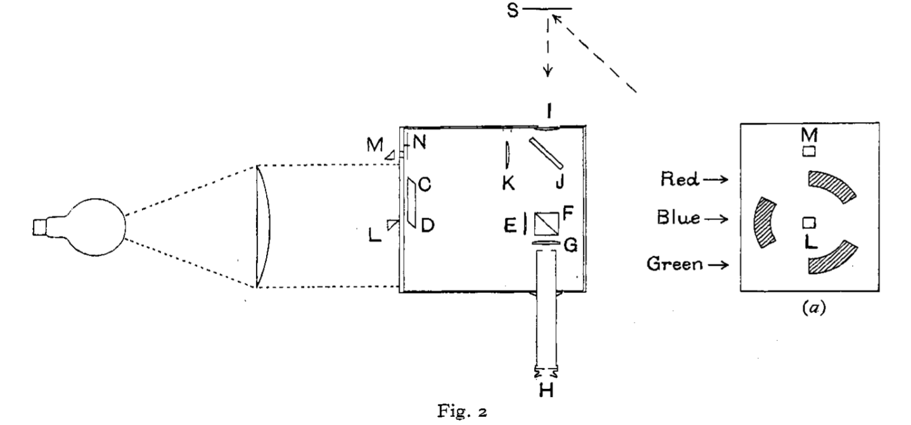

# 莱特-吉尔德实验

光刺激视网膜上不同种类的视锥细胞而后由大脑处理刺激信号而产生了人对光的颜色感知，因此要标定颜色必须要研究人眼对光的颜色主观感知特性而非光作为电磁波的客观属性。在20世纪20年代末期，英国的莱特（ W. D. Wright）和吉尔德（ J. Guild）独立开展了一系列关于色彩匹配的实验。这些实验的结果是色度学计算的基础而正是在此基础上1931年CIE规定了1931 CIE 标准色度学系统。遗憾的是，由于年代久远，很多数据已经遗失，这里我们以吉尔德的实验为主展开讨论。

## 实验设计

### 仪器概览

如图，这是吉尔德在文章《A trichromatic colorimeter suitable for standardisation work》中的一幅插图。左侧是实验装置的俯视图，右侧的方框是产生三原色所用的滤光片的构造。

示意图中最左侧是一盏特制的灯泡，它可以在空间中发出亮度的非常均匀灯光。它的右侧是一个凸透镜，它将灯泡发出的光转化为一束平行光。平行光会打在右侧的箱子上，箱子左边立面的结构如图（a）所示。其中阴影部分为三种滤光片。滤光片处于一个环上，环上中间的空缺部分是遮光片，遮光片可以帮助调节三种色光的分配比例。理论上滤光片与其对应的遮光片都应对应环上的 $$60^\circ$$ ，但为了防止遮光片遮挡其他滤光片，滤光片的角度被略微压缩到 $$59^\circ$$ 。当穿过滤光片后三色光依然是独立的，此时需借助一块棱镜，当它的C点经过滤光片时，滤光片的光会向D方向偏折。如果我们用电动机带动它绕DE轴转动，那么三色光都会向DE轴偏折。只要转速足够快，人眼看起来三色光就会发生叠加。在时间上叠加的光又到达透镜E，它的焦平面就在CD上，这样一来，光又变成了平行光。于是三原色叠加产生的光就形成了。

待匹配的颜色从箱子的I处射入，射入前单色光先照射到S处放置的漫反射物体（如纸张、纤维等）上，而漫反射物体恰好放置在I处凸透镜的焦点位置。据吉尔德所述，这样的放置使得H处的观察者看不到漫反射物体的具体结构，而只有均匀明度的单色光。

L与M处的棱镜可以将左侧的平行光转移到接近M的一个小孔中垂直立面射入。这书光的作用便是将一种色光（不一定是三原色的一种）加入到待匹配的色光中。首先它经过可以装滤色片的转盘N，然后再经过透镜K转为平行光。此后，它在玻璃片J上与待匹配色光混合。

最后，F是两块棱镜的叠加。它们在俯视图上的位置如图，而在高度上两者的斜边上只有一半面积相对。

