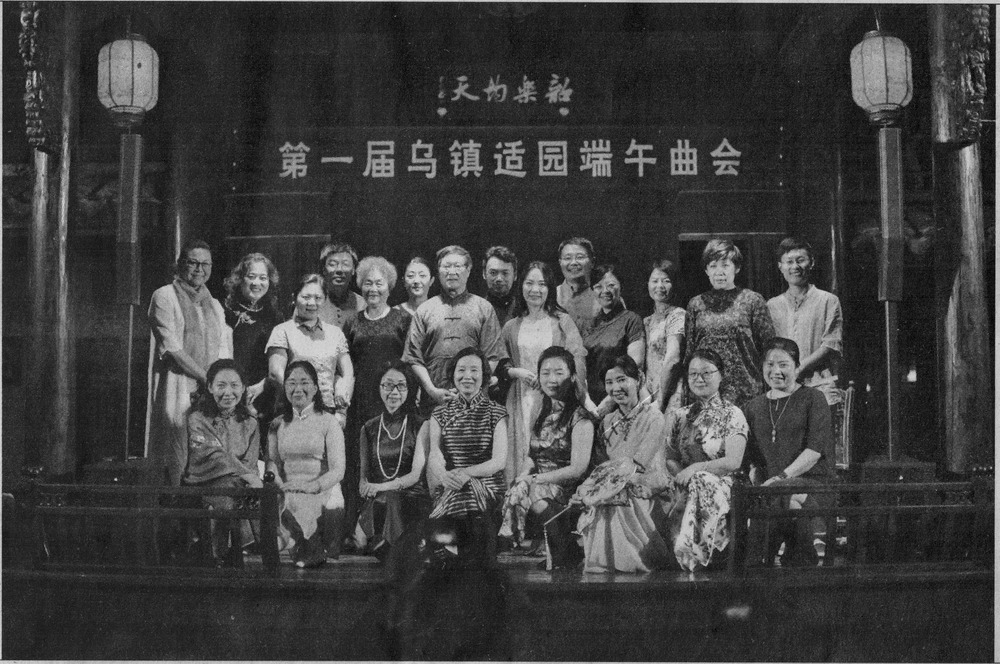
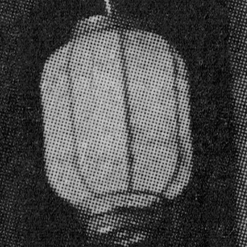
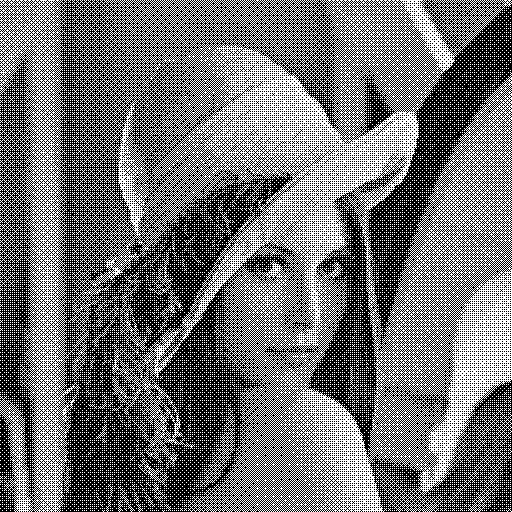
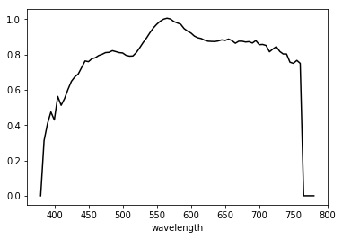
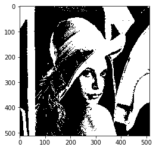
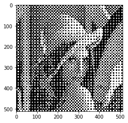
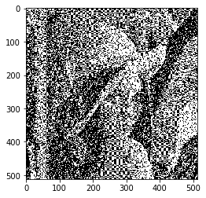
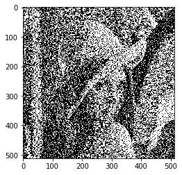
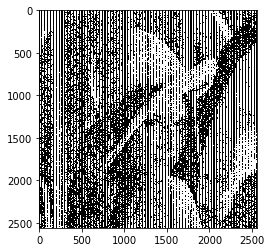

# 图像二值化



先来看一张报纸上的图片，如果你觉得它有什么特殊含义那你想多了，这是我随手拿的一张报纸然后扫描的。扫描过程中，先设定为24位彩色图像，然后利用`convert`命令进行旋转后将colorspace设定为Gray，然后裁剪并压缩转换为png格式。

下图为右上角的灯笼



你可以看到灯笼上有明显的黑点而不是数字图像放大后出现的均匀色彩变化的特点。这是因为打印机只能控制某个点上是否要染墨水，而不能决定一个点上需要多少墨水。无论是喷墨还是激光打印机都是如此。这看似限制了我们对于色彩的表达，但我们可以充分利用视觉的局限性——人眼只能分辨大于一定视角的细节而对于这个视角以内的细节无法分辨——来表达一幅连续而均匀的图像。当我们将许多细小的点混在一个肉眼无法分辨的地方时，大脑就会误以为这就是一个点，而我们所感知的这一点的色彩即为这些小点所产生的混合色。这一混色过程有别于颜色转盘实验中的时间混合，被称为空间混合。彩色电视、计算机显示器都运用了这一原理，但与打印不同，这些显示设备的像素点的三原色发光强度可以被设定为一系列的数值，而不是两种状态。另外，值得注意的是，人眼分辨细节的能力由视角这一概念判断，因此单位面积内可以“欺骗”人眼的最少点数与观看距离成反比。设计中观看距离较远的媒介，如大型LED广告牌，单位面积上的点数就可以少一些。

在日常打印过程中，电脑会自动处理好这样的二值化转换，但现在让我们一起探讨一下这一过程背后的原理。先来看一下我们所需要的外部包：`plt`用于在显示图片，`mpimg`用于图片的输入与输出，最后，`numpy`用于处理数学计算。注意：由`mpimg`读入的图像像素为取值范围是\[0, 1\]的浮点数，所以有时我们需要乘上255并取整来确保算法正常运行。导出图片时，请注意`plt.imshow`函数只能为我们提供预览来验证算法是否工作，如果要查看最终成果，应该使用`plt.imsave`函数导出。如下图这是Bayer抖动算法结果用`imsave`保存的结果，可以说与下文的`imshow`结果是天壤之别。另外，建议检查照片查看器是否存在插值处理（放大后观察像素是方块状还是形成了有梯度的小圆点），如果没有找到合适的查看器，可以用gimp编辑器查看。



```python
import matplotlib.pyplot as plt
import matplotlib.image as mpimg
import numpy as np
%matplotlib inline
```

```python
lena = mpimg.imread('img/lena_std.png')
lena = np.dot(lena[..., :], [0.2126, 0.7152, 0.0722])
plt.imshow(lena, cmap='gray')
```



## 50%阈值法

一种非常直接，非常Naive的方式便是直接将亮度值低于0.5的设为0，超过0.5的像素设为1，这样做造成了大面积黑色区域以及白色区域，也就造成了图像中明暗细节的丢失。

```python
lena_1 = lena.copy()
lena_1[lena_1 < 0.5] = 0
lena_1[lena_1 >=0.5] = 1
plt.imshow(lena_1, cmap='gray')
```



## 抖动技术

### 模式抖动

模式抖动中最具代表性的是柯达工程师Bayer在1973年依前人改进的方法，因此人们往往把模式抖动称为Bayer抖动。Bayer抖动也用到阈值，不过它用的是一张阈值矩阵，也叫作抖动矩阵。在生成阈值矩阵后将像素值超过阈值矩阵中元素值的结果设为1，反之设为0。很多情况下，图像尺寸会比阈值矩阵大，此时就要将阈值矩阵通过不断复制的方法向右及向下拓展直至阈值矩阵尺寸大于图像，但这里我们将采用取模的方法确定像素在阈值矩阵中对应的位置来减少计算。

生成阈值矩阵的递归过程可以参阅维基百科上对[模式抖动的介绍](https://en.wikipedia.org/wiki/Ordered_dithering)。在这里，我们使用的是8乘8的阈值矩阵。由于此方阵中元素取值范围是\[0, 63\]（63位整数），我们需要将8位的灰度图像的后2位截取。虽然损失了精度但视觉效果还是可行的。从结果可以看到（在数字显示设备上建议尝试调整图片大小后观看），相比于50%阈值法，这种方法保留了右侧镜子、肩膀上的灰度。但它的局限性在于将同一种模式应用于整幅图片，略作放大就可以看到许多排列整齐的`×`型图案。

```python
def bayer_pattern(n):
    # n必须为2的次幂，此处省略对n的合法性检查
    if n == 1:
        return np.array([0])
    else:
        result = np.empty([n, n])
        bayer_low = bayer_pattern(n // 2)
        ones = np.ones([n//2, n//2])
        result[:n//2, :n//2] = 4 * bayer_low
        result[:n//2, n//2:] = 4 * bayer_low + 2 * ones
        result[n//2:, :n//2] = 4 * bayer_low + 3 * ones
        result[n//2:, n//2:] = 4 * bayer_low + ones
        return result
```

```python
bayer_diffusion_matrix = bayer_pattern(8)
bayer_diffusion_matrix
```

```text
array([[ 0., 32.,  8., 40.,  2., 34., 10., 42.],
       [48., 16., 56., 24., 50., 18., 58., 26.],
       [12., 44.,  4., 36., 14., 46.,  6., 38.],
       [60., 28., 52., 20., 62., 30., 54., 22.],
       [ 3., 35., 11., 43.,  1., 33.,  9., 41.],
       [51., 19., 59., 27., 49., 17., 57., 25.],
       [15., 47.,  7., 39., 13., 45.,  5., 37.],
       [63., 31., 55., 23., 61., 29., 53., 21.]])
```

```python
lena_2 = lena.copy()
lena_2 = 255 * lena_2
lena_2 = lena_2.astype(np.int)
def bin_right_move(n):
    return n >> 2
lena_2 = np.vectorize(bin_right_move)(lena_2)

for i in range(lena_2.shape[0]):
    for j in range(lena_2.shape[1]):
        x = i % 8
        y = j % 8
        if lena_2[i, j] > bayer_diffusion_matrix[x, y]:
            lena_2[i, j] = 1.0
        else:
            lena_2[i, j] = 0.0
plt.imshow(lena_2, cmap='gray')
```



### 误差扩散抖动

为了减少Bayer抖动产生的规则化图形，我们可以采取误差扩散方法。此方法的核心为将每个像素在二值化中将产生的误差按一定比例分配到其他还未处理的像素上。这可以说是阈值法的一种改进，即将无规则噪声加入到处理过程中。我们先确定一个矩阵来表达误差分配的比例，然后在每一行上的每一像素进行阈值比较并分配误差。这里我们介绍两种分配方案：第一种是1975年由Floyd-Steinberg提出的过滤器，也叫误差分配表，第二种是Stucki过滤器。Stucki是前一种方案的改进，但由于增加了过滤器的大小，自然也造成了速度慢的缺陷。

实现过程中，为了避免边界情况的讨论，我们可以将原图像四周填充`0`，不过这需要索引值的转换。《计算机色彩原理及应用》中介绍，抖动处理时可采用螺旋型扫描的方案（先从左到右，下一行再从右到左，循环往复），但经过实验（将下文函数中`i % 2 == 0`的判断条件直接换为`True`）这似乎并没有起到太大效果。还要注意，这种螺旋型扫描中在从右往左的过程中应该左右反转`mat`，否则无法将误差传递给同一行上左边的像素。此外，为了提高效果，可以借用`cv2`模块中的`resize`函数将图像放大后再处理，尽管关于图像信息量可以说没有增加，但效果确实出奇的好。


没错，原图放大后就是黑点和白点。

```python
def FS_diffusion(img, mat):
    # mat应为n×n的矩阵，且n为奇数，此处省略检查
    img_x, img_y = img.shape
    mat_x, mat_y = mat.shape
    im_ex = np.zeros([img_x + 2*(mat_x//2),
                      img_y + 2*(mat_y//2)])
    im_ex[mat_x//2: -(mat_x//2), mat_y//2: -(mat_y//2)] = img
    new_im = np.empty([img_x, img_y])

    for i in range(img_x):
        for j in range(img_y):
            _i = i + mat_x//2
            if i % 2 == 0:
                _j = j + mat_x//2
                _mat = mat
            else:
                _j = img_y - j - 1 + mat_y//2
                _mat = mat[:,::-1]
            if im_ex[_i, _j] >= 0.5:
                error = im_ex[_i, _j] - 1
                new_im[i, _j - mat_y//2] = 1.0
            else:
                error = im_ex[_i, _j] - 0
                new_im[i, _j - mat_y//2] = 0.0
            im_ex[_i - mat_x // 2: _i + mat_x // 2 + 1,
                  _j - mat_y // 2: _j + mat_y // 2 + 1] +=\
            error * _mat
    return new_im
```

```python
diffuse_matrix = np.array([[0, 0, 0],
                           [0, 0, 7],
                           [3, 5, 1]]) / 16
```

```python
lena_3 = lena.copy()
lena_3 = FS_diffusion(lena_3, diffuse_matrix)
plt.imshow(lena_3, cmap='gray')
```



```python
diffuse_matrix_l = np.array([[0, 0, 0, 0, 0],
                             [0, 0, 0, 0, 0],
                             [0, 0, 0, 8, 4],
                             [2, 4, 8, 4, 2],
                             [1, 2, 4, 2, 1]]) / 42
lena_3 = lena.copy()
lena_3 = FS_diffusion(lena_3, diffuse_matrix_l)
plt.imshow(lena_3, cmap='gray')
```



```python
import cv2

lena_3 = lena.copy()
lena_3 = cv2.resize(lena_3, dsize=(4096, 4096))
lena_3 = FS_diffusion(lena_3, diffuse_matrix_l)
plt.imshow(lena_3, cmap='gray')
```


## 加网技术

与前文所述的二值化采用一个灰阶像素寻找一个二值化像素的对应思路不同，加网技术的基本单元是一个网点，网点内还分小栅格。虽然小栅格的取值还是只能为“0”和“1”，但这种方法同样运用了人眼的分辨率局限性，当视角较小时，纸张上反射的白色光与黑色光混合就形成了灰度。因此网点上被油墨覆盖的面积大小（也称网点面积率或网点面积覆盖率）决定了网点所处的灰阶位置。根据网点中小栅格置黑的规则不同，加网技术主要分为调幅加网和调频加网，当然还有组合运用的混合加网。这里的幅度指的是单位元的黑度，频率指的是单位元之间的距离。

### 调幅加网

调幅加网中相邻网点与网点的距离始终一致，同时根据原图中的像素值确定从网点中间开始填涂多少个小栅格。以下为几种常见的加网方案：

  1. 模型法
  对于特定的灰度等级预先设计好网点模型，比如网点中确定有5×5个小栅格，那么对于它能表现的26种灰阶都要人为设计一种填充方案。转换时每读取一个连续色调的像素，就要去寻找这26种灰阶中最接近的那种，然后将它的对应方案填入生成的图像中。这是调幅加网的最基本思路，而下面所说的两种则是这种方法的改进或更为具体的实现。
  2. 生长模型法
  这种方法与前文所述的阈值法有些类似，但阈值法的阈值矩阵作用于一块像素区域上，而生长模型法的阈值矩阵作用于连续色调的同一像素点上通过比较阈值矩阵上的每一单元确定转换后该像素所对应的网点中的置黑小栅格的分布情况。
  3. 对半取反法
  生长模型法中每个像素计算网点时都要进行大量赋值操作，为了减少赋值过程所耗的时间，对半取反法中对网点面积率大于50%的网点，以互补的小百分比网点的模型反向获得所需要的网点密度。注意，偏向黑色的点这种方法产生的网点中置黑的小栅格位置与直接生成不同，但网点面积率不变。


```python
screen_matrix = np.array([[18, 12, 11, 14, 19],
                        [22, 9,  5,  8,  25],
                        [17, 3,  1,  2,  16],
                        [24, 7,  4,  6,  23],
                        [20, 15, 10, 13, 21]])
```


```python
def growing_model(img, mat):
    img_x, img_y = img.shape
    mat_x, mat_y = mat.shape
    new_im = np.empty([img_x * mat_x, img_y * mat_y])
    for i in range(img_x):
        for j in range(img_y):
            gray_level = round(mat.size * img[i, j])
            _s = np.zeros_like(mat)
            _s[mat <= gray_level] = 1.0
            new_im[i * mat_x: (i+1) * mat_x,
                   j * mat_y: (j+1) * mat_y] = _s
    return new_im
```


```python
lena_4 = lena.copy()
lena_4 = growing_model(lena_4, screen_matrix)
plt.imshow(lena_4, cmap='gray')
```


    <matplotlib.image.AxesImage at 0x7f1e080a4cf8>


```python
def half_reverse(img, mat):
    img_x, img_y = img.shape
    mat_x, mat_y = mat.shape
    new_im = np.empty([img_x * mat_x, img_y * mat_y])
    for i in range(img_x):
        for j in range(img_y):
            reverse = False
            gray_level = round(mat.size * img[i, j])
            
            if gray_level <= 0.5:
                _s = np.zeros_like(mat)
                _s[mat <= gray_level] = 1.0
            else:
                _s = np.ones_like(mat)
                _s[mat > gray_level] = 0.0
            new_im[i * mat_x: (i+1) * mat_x,
                   j * mat_y: (j+1) * mat_y] = _s
    return new_im
```


```python
lena_4 = lena.copy()
lena_4 = half_reverse(lena_4, screen_matrix)
plt.imshow(lena_4, cmap='gray')
```


    <matplotlib.image.AxesImage at 0x7f1de41457b8>


```python
lena_4 = lena.copy()
%timeit -n20 growing_model(lena_4, screen_matrix)
```

    2.12 s ± 22.1 ms per loop (mean ± std. dev. of 7 runs, 20 loops each)


```python
lena_4 = lena.copy()
%timeit -n20 half_reverse(lena_4, screen_matrix)
```

    1.88 s ± 37 ms per loop (mean ± std. dev. of 7 runs, 20 loops each)


### 调频加网

可以看到，调幅加网产生的图像同模式抖动一样产生了由特定规则造成的模式化的雷同图案。调频加网的计算过程中虽然保留了网点的概念，但是在网点中阈值矩阵中所有元素都被随机函数打乱。这样一来，虽然我们依然采用一个连续像素对应一个网点，但是放大生成的图像后很难再看到调幅加网中产生的规则图案也很难指出哪一群小栅格对应的是一个网点。因此对于生成的图像来说，图像的最小单元可以认为不再是网点，而是一个个的微粒点。这些微粒点的亮度（振幅）固定，不是0即是1，而它们之间的密度（频率）随图像特点改变。调频加网的算法与调幅加网的类似，只是加上了一个随机过程。


```python
def growing_model_fm(img, mat):
    img_x, img_y = img.shape
    mat_x, mat_y = mat.shape
    new_im = np.empty([img_x * mat_x, img_y * mat_y])
    for i in range(img_x):
        for j in range(img_y):
            np.random.shuffle(mat)
            
            gray_level = round(mat.size * img[i, j])
            _s = np.zeros_like(mat)
            _s[mat <= gray_level] = 1.0
            new_im[i * mat_x: (i+1) * mat_x,
                   j * mat_y: (j+1) * mat_y] = _s
    return new_im
```


```python
lena_5 = lena.copy()
lena_5 = growing_model_fm(lena_5, screen_matrix)
plt.imshow(lena_5, cmap='gray')
```


    <matplotlib.image.AxesImage at 0x7f1de411d908>





### 混合加网

混合加网是借鉴调幅和调频的两种网点的特性的加网技术。比如用调幅网点表达中间色调，用调频网点表达高光和暗调。在运用调幅网点时，可能不再采用调幅加网中之前阈值矩阵关于中心基本对称的特点，而是随机移位。这些技术目前由一些大企业专利所有，在此不进行详细讨论，不过我们还是可以根据现有的材料简单地实现一下。


```python
def mixed(img, mat):
    img_x, img_y = img.shape
    mat_x, mat_y = mat.shape
    new_im = np.empty([img_x * mat_x, img_y * mat_y])
    _mat = mat.copy()
    for i in range(img_x):
        for j in range(img_y):
            gray_level = round(mat.size * img[i, j])
            if img[i, j] < 0.8 and img[i, j] > 0.2:
                _s = np.zeros_like(mat)
                _s[mat <= gray_level] = 1.0
            else:
                np.random.shuffle(_mat)
                _s = np.zeros_like(_mat)
                _s[_mat <= gray_level] = 1.0
            new_im[i * mat_x: (i+1) * mat_x,
                   j * mat_y: (j+1) * mat_y] = _s
    return new_im
```


```python
lena_6 = lena.copy()
lena_6 = growing_model_fm(lena_6, screen_matrix)
plt.imshow(lena_6, cmap='gray')
```


    <matplotlib.image.AxesImage at 0x7f1de4078a20>


